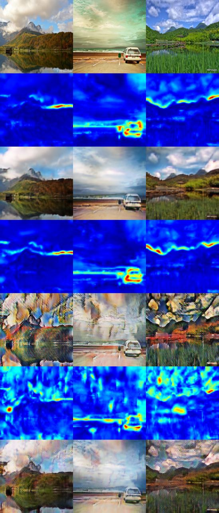

# Experiment with light version of U-GAT-IT model.

In this directory we conduct experiments with the U-GAT-IT model from the official repository. To run an experiment by yourself:

First properly add your dataset to ‘dataset’ folder. (as in official repository)

Link to landscape2cubism dataset: https://drive.google.com/file/d/1DmHKJbrw5W_B7floXiDJ7r-CKbHpkV1T/view?usp=sharing

Then run:

python main.py --dataset landscape2cubism --light True --device [cpu/cuda/mps]] --iteration [number_of_epochs] --print_freq 100 --save_freq 100

Our results

5000 epochs with use of cycle loss:

